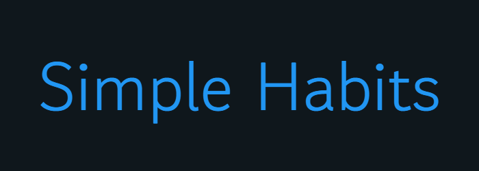
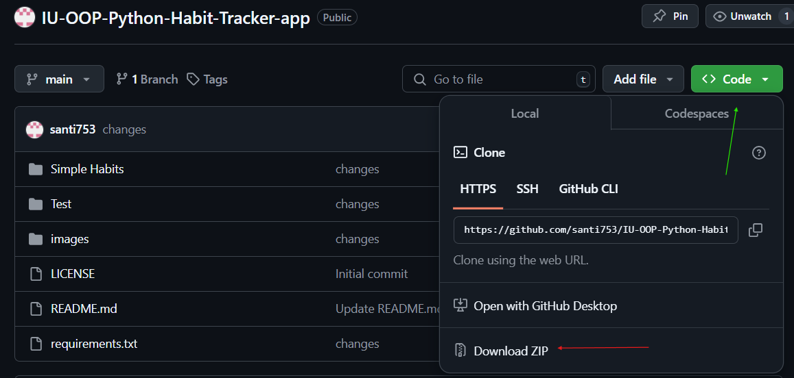
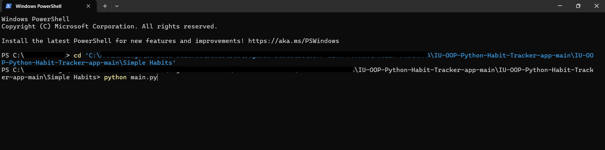
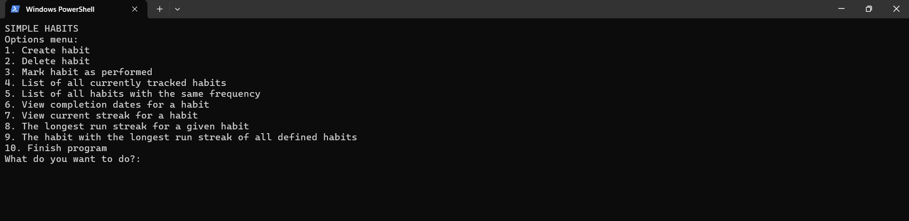
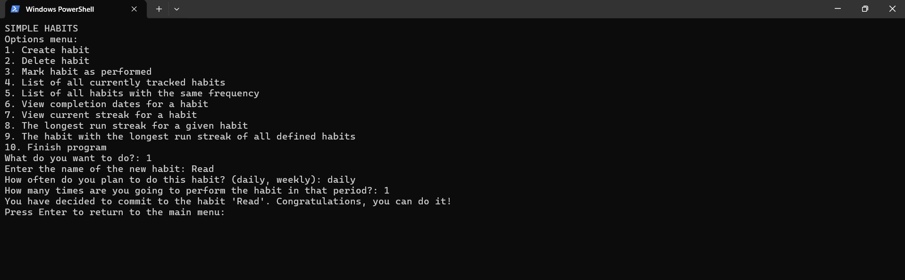

<p align="center">
  
</p>

# Simple Habits - Habit Tracking Application

A Python-based habit tracking application that helps users create, maintain, and analyze their daily and weekly habits. This application was developed as part of the Object-Oriented Programming course at IU International University.

## Table of Contents
1. [Features](#features)
2. [Installation](#installation)
   - [Prerequisites](#prerequisites)
   - [Required Packages](#required-packages)
   - [Setup](#setup)
3. [Usage](#usage)
   - [Example Usage](#example-usage)
4. [Project Structure](#project-structure)
   - [Core Files](#core-files)
   - [Additional Files](#additional-files)
5. [Testing](#testing)
   - [Running Tests](#running-tests)
   - [Test Coverage](#test-coverage)
   - [Test Database](#test-database)
6. [Contributing](#contributing)
7. [License](#license)

## Features

- Create and delete habits with customizable periodicity and frequencies (daily/weekly)
- Track habit completion
- View all currently tracked habits in a formatted table
- Filter habits by frequency 
- View completion dates for specific habits
- Track current and longest streaks for each habit
- Find the habit with the longest streak
- Command-line interface for easy interaction
- SQLite database for persistent storage
- Comprehensive logging system

## Installation

### Prerequisites

- Python 3.8 or higher

### Required Packages

The following Python packages are required to run the application:

- datetime
- collections
- logging
- sqlite3
- tabulate
- click
- pytest
- os
- sys

### Setup

To start using the Simple Habits application, follow these steps:

1. **Download the project**
   - Go to the GitHub repository: https://github.com/santi753/IU-OOP-Python-Habit-Tracker-app
   - Click the green 'Code' button
   - Select 'Download ZIP'
   - Extract the ZIP file to your desired location on your computer

   

2. **Navigate to the program directory**
   - Open PowerShell
   - Navigate to the extracted folder using the cd command
   - You should be in the Program folder within Simple Habits
   - Example command:
     ```
     cd 'C:\PATH\IU-OOP-Python-Habit-Tracker-app-main\Simple Habits\Program'
     ```

   

3. **Run the application**
   - In the same PowerShell window, type: `python main.py`
   - The application will start and show you the main menu
   - You can now start creating and tracking your habits!

   

**Troubleshooting**
- Make sure Python is installed on your computer
  - To check, type `python --version` in PowerShell
  - If not installed, download it from python.org
- Ensure you're in the correct directory (Program folder) when running the commands

> **Note**: While these instructions are for Windows users, the application can be run on MacOS and Linux with very similar steps,
> just adjusting the commands for the command line or Terminal instead of PowerShell.

## Usage

When you run the application, you'll be presented with a menu-driven interface offering the following options:

1. **Create habit**
   - Name your new habit
   - Choose frequency (daily/weekly)
   - Set periodicity (how many times per day/week)

2. **Delete habit**
   - Select a habit from your list to remove it
   - Confirmation required before deletion

3. **Mark habit as performed**
   - Select a habit to mark as complete
   - System checks if marking is allowed based on periodicity
   - Automatic tracking of completion dates

5. **Analyze habits**
   - List all currently tracked habits
   - Filter habits by frequency (daily/weekly)
   - View completion dates for specific habits
   - Check current streaks
   - See longest streaks

### Example Usage



## Project Structure

The project follows an object-oriented design with the following main components:

### Core Files

- **main.py**
  - Main program entry point
  - Command-line interface implementation
  - Menu-driven user interaction
  - Program flow control

- **habit.py**
  - `Habit` class implementation
  - Core functionality for habit management
  - Completion tracking logic
  - Streak calculation methods

- **database.py**
  - `Database` class for data persistence
  - SQLite database management
  - CRUD operations for habits
  - Completion date storage

- **analysis.py**
  - Habit analysis functions
  - Data visualization (table format)
  - Streak calculations
  - Filtering capabilities

- **test.py**
  - Comprehensive test suite
  - Unit tests for all core functionality
  - Database testing
  - Streak calculation verification

### Additional Files

- **habits.db**
  - SQLite database file
  - Stores habit data and completion records
  - Created automatically on first run

- **habit_tracker.log**
  - Logging file
  - Tracks program operations
  - Records user actions and system events

## Testing

The application includes a comprehensive test suite using pytest to ensure reliability and correct functionality.

### Running Tests

To run all tests:
- `python -m pytest test.py`

To run tests with detailed output:
- `python -m pytest -v test.py`

### Test Coverage

The test suite covers three main components:

1. **Habit Class Testing**
   - Habit creation and initialization
   - Habit performed
   - Can mark performed
   - Current streak calculations
   - Longest streak calculations

2. **Database Testing**
   - Database creation and initialization
   - Table structure verification

3. **Main Program Menu Functions**
   - Habit creation functionality
   - Habit deletion process
   - Viewing all habits
   - Filtering habits by frequency
   - Viewing completion dates
   - Checking current streaks
   - Calculating longest streaks
   - Finding habits with longest streaks

### Test Database

Tests use a separate test database (`test_habits.db`) to ensure:
- Isolation from production data
- Clean testing environment
- No interference with user data
- Automatic cleanup after testing

## Contributing

If you find any issues or have feature requests, please open an issue on our Github repository. 
Code contributions in the form of Pull Requests are also welcome. 

## License

This project is licensed under the MIT License.

MIT License

Copyright (c) 2024 santi753
